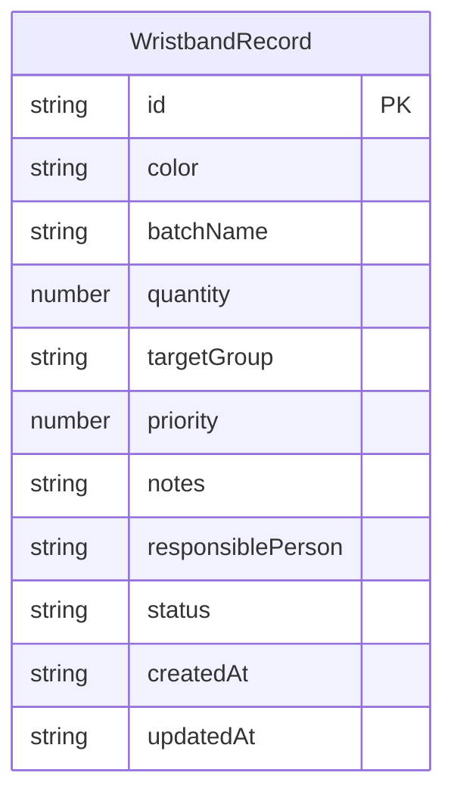

## 1. 架构设计

```mermaid
graph TB
    "React 前端" --> "Zustand Store"
    "Zustand Store" --> "localStorage 持久化"
    "Zustand Store" --> "自动检查引擎"
    "React 前端" --> "手环管理主页"
    "React 前端" --> "批次速览视图"
    "自动检查引擎" --> "检查结果状态"
```

纯前端架构，无后端服务。数据通过 Zustand Store 管理，自动同步到 localStorage。

## 2. 技术说明

- 前端：React@18 + TypeScript + Tailwind CSS + Vite
- 初始化工具：vite-init
- 状态管理：Zustand（含 localStorage 中间件）
- 后端：无
- 数据库：localStorage（浏览器本地存储）

## 3. 路由定义

| 路由 | 用途 |
|------|------|
| / | 手环管理主页（含列表视图与批次速览视图切换） |

单页应用，通过组件内状态切换两种视图，无需多路由。

## 4. API 定义

无后端 API，所有数据操作在 Zustand Store 中完成。

## 5. 服务端架构

不适用

## 6. 数据模型

### 6.1 数据模型定义



### 6.2 数据定义

**WristbandRecord 字段说明：**

| 字段 | 类型 | 说明 |
|------|------|------|
| id | string | UUID 唯一标识 |
| color | string | 手环颜色（如：红色、蓝色、绿色） |
| batchName | string | 批次名称 |
| quantity | number | 数量 |
| targetGroup | string | 适用人群 |
| priority | number | 优先发放顺序（1 为最高） |
| notes | string | 异常备注 |
| responsiblePerson | string | 责任人 |
| status | string | 状态：待分装 / 待复核 / 可发放 / 暂缓 |
| createdAt | string | 创建时间 ISO 字符串 |
| updatedAt | string | 更新时间 ISO 字符串 |

**自动检查规则：**

| 检查项 | 规则 | 级别 |
|--------|------|------|
| 颜色重复映射 | 同一颜色出现在不同批次且适用人群不同 | 警告 |
| 数量为零可发放 | quantity === 0 且 status === '可发放' | 严重 |
| 责任人堆积 | 同一责任人超过 5 条高优先级（priority ≤ 3）且状态非暂缓 | 警告 |
| 优先级断档 | 全局优先级序列存在跳号（如 1,2,4 缺少 3） | 提示 |

**localStorage 键名**：`wristband-color-group-data`
